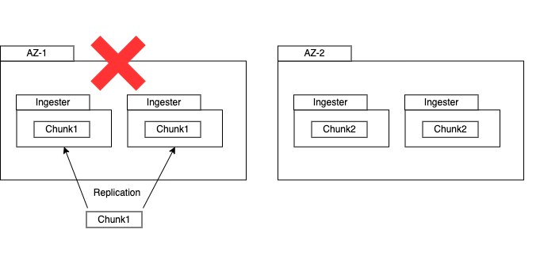

# Design for failure

### Overview

In this section, I'll introduce some tips to design for failure in Loki.

This section can't cover all of the cases but these tips were helpful for my usecases so let me introduce them.

### Storage failure

The products which have 100% availability don't exist in this world, AWS S3 can have outages.

It means that we need to pay attention to the storage failure.

So, What happens when the storage fails?

Here is the image.


The goroutine which flushes chunks to AWS S3 in an ingester is affected.

However, the writing logs to ingesters will be successful because the flushing is asynchronized.

It means that more and more memory chunks and write-ahead logs will be increasing while the failure.

It causes OOM and once it happens, it is hard to restart the ingester process because the recovery process from WAL will be started before restarting and the WAL is the snapshot of memory chunks so it's going to cause OOM again.

We need to configure appropriate resource requests to the ingesters in advance to address this issue.

At least, we need to satisfy this formula.

```
N: the number of ingesters
MS: memory size in an ingester
S: received log bytes for unit time
T: desired time to buffer while the failure
RF: replication factor

N * MS > S * T * RF
```

How is query process in this failure?

I said that queriers create an iterator and load chunks from it one by one in this section.


[filter-the-matched-chunks.md](query-process/filter-the-matched-chunks.md)


Query requst will be failed when queriers try to load from AWS S3 while the storage failure.

Therefore, the request which all of results are in cache or memories on ingesters will be successfull, otherwise failed.

### Ingester failure

#### Zone aware replication

We need to take care of ingesters.

When some ingesters are down, unflushd chunks on them can be lost.

Of course, WAL works fine for that but Loki doesn't stop ingestions even if writing WAL is failed so it's not perfect.

Replication factor is also helpful to address this issue but it maybe better to use zone aware replication for availability zone failure.



For example, we imagine that a chunk is wrriten to two ingesters in AZ-1 like this image.

If AZ-1 is failiure, chunk1 will be lost in this case.

How should I address that?

We can use zone aware replication.



We'll set 'true' to 'zone\_awareness\_enabled' and each desired zone to 'instance\_availability\_zone' in all of ingesters in advance so that distributors can route post logs request to multiple ingesters across multiple AZ to replicate.

#### Limiting the number of unhealthy Ingesters

There is the limit for the number of unhealthy ingesters.

It is implemented like this.

```
numRequired = len(Ingesters) - ReplicationFactor / 2
```

[https://github.com/grafana/dskit/blob/main/ring/ring.go#L506](https://github.com/grafana/dskit/blob/main/ring/ring.go#L506)

If the number of unhealthy ingesters is more than this value, all of queries will be failed.

Therefore, we need to pay attention to that when especially updating the ingesters.
