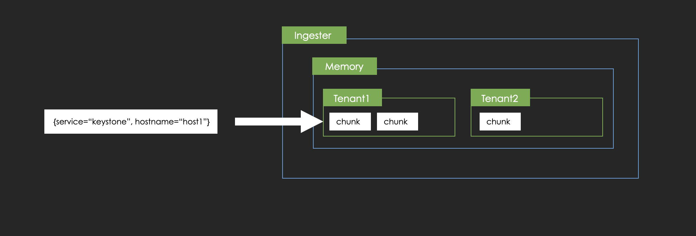
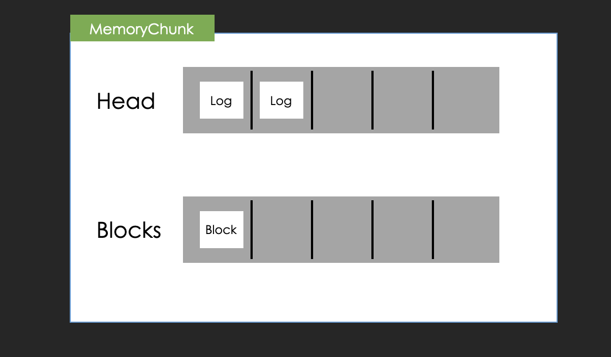
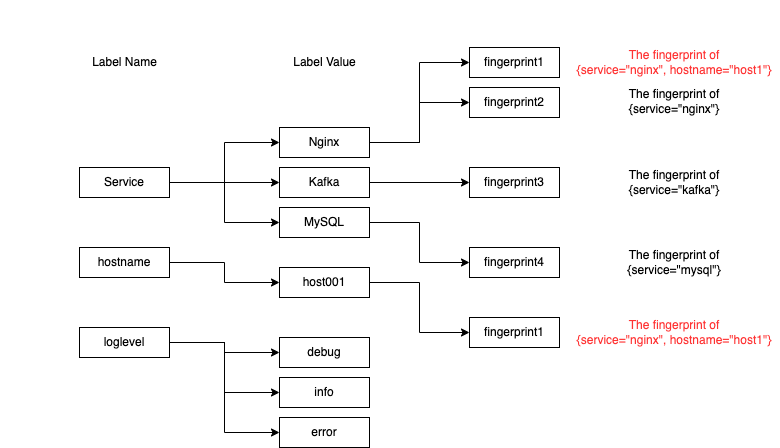

# Buffering log chunks on memory

### How to handle log post request

Let's see how ingesters handle the requests.

At first, coming logs are appended to "memory chunk" on memory by each stream.

In addition, the write-ahead log for each log is written on Ingester's disk to prevent it from losing log data unexpectedly. (described later)

Lastly, if the appending is succeeded, ingester returns success as gRPC response.

The chunks aren't stored in remote storage like AWS S3 immediately.

They are buffered unless they satisfy some conditions.

If they satisfy those conditions, ingesters will flush them to remote storage.

### Memory Chunk

The ingesters have a data structure to buffer logs called "memory chunk".

The memory chunk is constructed like this image.

It has an array called "Head" and another one "Blocks".

At first, incoming logs are appended to "Head" with keeping the raw data.

When its size reaches "chunk\__block_\_size", the ingester will compress the all of elements in "Head" into a block.

When the total size of the memory chunk reaches "chunk\_target\_size", Ingester makes it read-only mode and appends it to a flush queue.

Does buffering logs mean that we can't query for recent logs?

No, it doesn't. Ingesters are also queried for logs from queriers.

So, how does it search all over memory chunks in ingesters efficiently?

The answer is using inverted indexes.

### Inverted Index for memory chunks

An ingester has inverted indexes on their memory like the following image.

This is a map structure that maps label key-value pairs to each stream fingerprint.

The fingerprints are generated as hash values of label key-value pairs for each stream.

For example, a stream `{service="`nginx", hostname="host1"`}`is converted to a fingerprint, which is "fingerprint1" and it is attached to service=nginx and hostname="host1" entries in the map.

In addition, the ingester has also a map that maps fingerprints to actual streams so that it can resolve the streams from the fingerprints.

Here is the flow of how the ingester extracts the matched chunks from memory when querying \`{service="nginx", hostname="host1"}\`.

1. Split the query into `{service="nginx"}` and `{hostname="host1"}`
2. Select the matched fingerprints for each label value pair, `{service="nginx"}` and `{hostname="host1"}` . In this case, "fingerprint1" and "fingerprint2" will be matched.
3. Extract common fingerprints across all of them, in this case, it's "fingerprint1".
4. Resolve the matched streams and chunks on memory from the fingerprints
