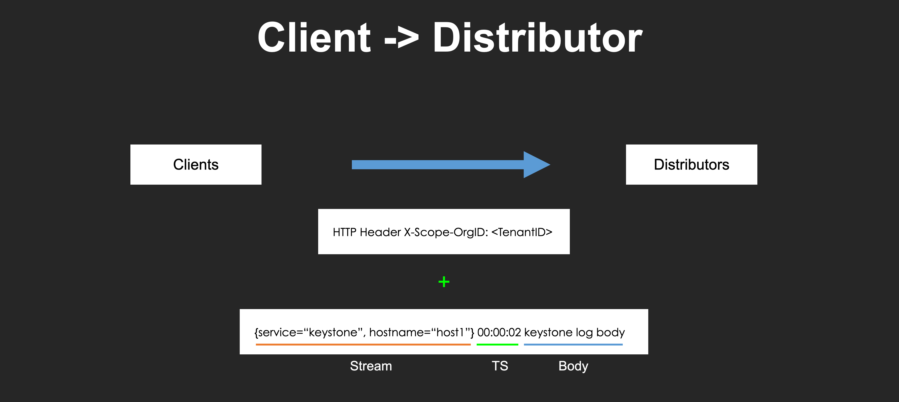

# Posting logs to Distributors



Loki clients construct log body and tenant-id as HTTP requests.

The clients annotate tenant-id to HTTP Header so that Loki can recognize which tenant of logs it receives.

The request body has three kinds of fields, which are stream, timestamp, and actual log body.

Here is the actual format.

```
{
  "streams": [
    {
      "stream": {
        "label": "value"
      },
      "values": [
          [ "<unix epoch in nanoseconds>", "<log line>" ],
          [ "<unix epoch in nanoseconds>", "<log line>" ]
      ]
    }
  ]
}
```

#### What is stream?

The logs should have some labels like Prometheus.

We call the unique pattern that is a combination of tenant-id and label key-value pairs "stream".

The logs are going to be chunked and managed in every stream in ingesters.

#### Validation

The requests from the clients are validated by Distributors.

What points does it validate?

Mainly, it checks the following.

* Label format
  * invalid format?
* Log Body
  * too long?
* Log timestamp
  * too future or too old?
* Rate limit

If the rate limit mode is 'global', distributors will be clustered so that they can know the number of healthy instances in the cluster and calculate the ingestion rate for all over that.

It means that distributors are clustered for the validation.

If you want to know more detail about how to cluster, please read this chapter.


[clustering.md](../clustering.md)

