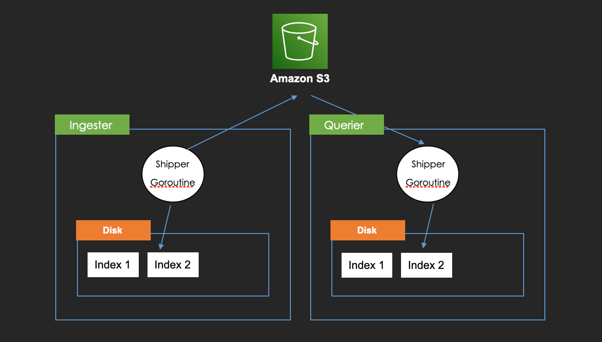
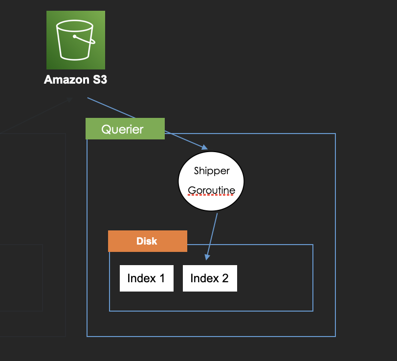

# What is BoltDB Shipper?

### Overview

Querier and Ingester don't communicate with AWS S3 directly to get inverted indexes.

Alternatively, they use BoltDB Shipper, which manages inverted indexes in local disk space and syncs with AWS S3 periodically.

This component is embedded in queriers or ingesters.

It acts as a write cache in the ingesters and also as a read cache in the queriers.

### How it works in the ingesters

In the ingestion process, the inverted indexes are written on this for persistency.

It periodically checks the differences between local files and AWS S3.

If there are some differences, it will ship them to AWS S3 and remove the uploaded files from local.

### How it works in the queriers

In the query process, this component acts as read cache.

It will download index files from AWS S3 when starting the querier process.

After that, if no index is found in querying, it will download and cache it on its disk.

In addition, it periodically deletes the index files which are expired.

### Conclusion

That's how queriers and ingesters use inverted index locally and BoltDB shipper syncs with AWS S3. This mechanism allows them to ingest or query with low latency with object storage.
